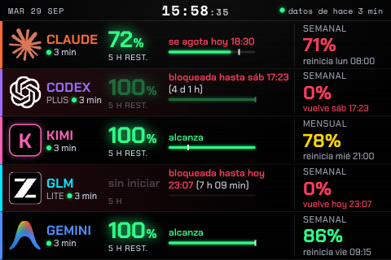

# Token HUD

See how much of your AI subscription quota is left, at a glance: the **5 h**, **weekly** and **monthly** windows for
**Claude**, **Codex**, **Kimi Code**, **GLM (z.ai)** and **Antigravity (Gemini)**.

It reads the usage numbers each provider already computes. There is no proxy in the middle and no tokens are counted.




## Components

| Component | What it is | Path |
|---|---|---|
| Collector CLI `cuota` | Queries providers every 5 min, writes `~/.cache/cuota/state.json`; table, `--json`, `--line`, `watch`, `doctor` views | [`collector/`](collector/README.md) |
| Menu bar app | Native macOS app: menu bar items or docked sidebar mode, logo + two stacked percentages per provider, menu with pace and freshness | [`menubar/`](menubar/README.md) |
| Web panel | Single-file page for a small secondary display (480×320) or a phone | [`panel/`](panel/README.md) |

All views only read `state.json`; only the collector talks to providers. See [`docs/ARCHITECTURE.md`](docs/ARCHITECTURE.md),
[`docs/STATE_CONTRACT.md`](docs/STATE_CONTRACT.md) and [`docs/PROVIDERS.md`](docs/PROVIDERS.md).

## Requirements

- macOS 14+ (the collector is plain Python and launchd-based; the menu bar app is macOS only)
- Python 3.12+ and [uv](https://docs.astral.sh/uv/)
- Swift 6 toolchain (only for the menu bar app)
- The provider CLIs you use: Claude Code, Codex CLI, Antigravity (`agy`); Kimi and GLM only need an API key

## Quick start

Collector:

```sh
cd collector
launchd/install.sh install     # installs `cuota`, schedules a run every 5 minutes
cuota doctor                   # checks sources, credentials, permissions
cuota                          # table view
```

Menu bar app (compiles Swift; run these yourself):

```sh
cd menubar
./build-app.sh
./install.sh install
```

Web panel:

```sh
mkdir -p panel/data && ln -sfn ~/.cache/cuota/state.json panel/data/state.json
python3 -m http.server 6739 --directory panel
# http://127.0.0.1:6739/index.html
```

## Credentials

- `KIMI_API_KEY` and `Z_AI_API_KEY`: export them in your environment or with an `export` line in `~/.zshrc`.
- Codex and Antigravity use their own CLI logins. Claude needs no credential: the collector reads the status line JSON that
  Claude Code produces (see [`collector/README.md`](collector/README.md) for the one-line `statusLine` setup).
- Nothing is stored: keys are resolved on each run and never written to disk or logs.

## Privacy

Everything is local. There is no telemetry and no server of ours. The collector only contacts the provider endpoints
listed in [`docs/PROVIDERS.md`](docs/PROVIDERS.md) with your own credentials. The web panel loads fonts from Google Fonts
and a QR library from jsDelivr when opened in a browser.

## Limitations

- Except for Claude's status line, the provider sources are **undocumented** endpoints or CLI outputs and may break at any time.
- macOS only (launchd, menu bar app).
- The user interface text (CLI, menu bar, panel) is in Spanish.
- Claude data is only fresh while a Claude Code session is active.

## Contributing

See [`CONTRIBUTING.md`](CONTRIBUTING.md).

## License

[MIT](LICENSE) © 2026 Felipe Venegas
