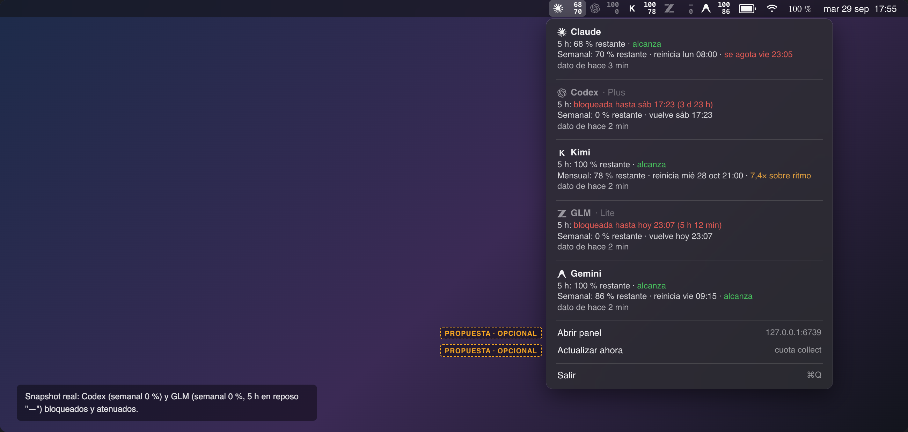
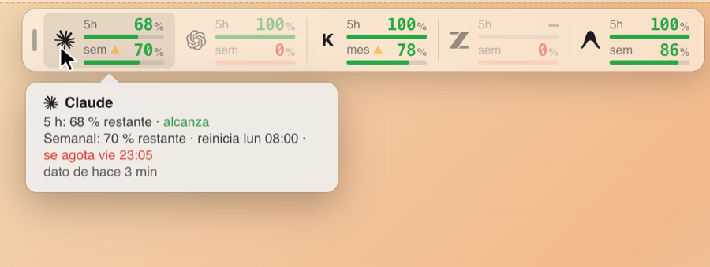

# Token HUD (menu bar)

Claude, Codex, Kimi, GLM and Gemini quotas in the macOS menu bar or as a docked sidebar. It reads the same `state.json`
(contract v1, see `../docs/STATE_CONTRACT.md`) as the web panel; no network and no credentials.

```
[logo] 68   <- % remaining in the 5 h window ("—" when idle)
       70   <- % remaining in the weekly window (Kimi: monthly)
```

A blocked provider (weekly/monthly window exhausted) is drawn at 45 % opacity; `stale` at 72 %;
`error` shows a "!" badge with the last good values. The menu lists, per provider, the 5 h and
weekly/monthly lines with pace ("on track", "N× over pace", "runs out…") and data freshness, plus
display mode and sidebar options, "Open panel", "Refresh now" and "Quit". The UI text is in Spanish.



## Sidebar mode

On notched MacBooks, menu bar status items that fall under the notch are hidden by macOS. Token HUD provides an alternative floating sidebar panel docked to screen edges instead of the menu bar.



### Display modes

- Two mutually exclusive display modes:
  - **Menu bar** (`"Barra de menú"`): standard status items in the macOS menu bar.
  - **Sidebar** (`"Barra lateral"`): floating panel docked to a screen edge; removes all status items from the menu bar while active. Switching back restores them.
- Switch modes in the menu under **"Mostrar en"** (`"Barra de menú"` / `"Barra lateral"`), or with the global shortcut **⌥⌘L**.
- Mode preference is remembered across launches in `UserDefaults`. Default is menu bar mode (`"Barra de menú"`).
- The global shortcut uses Carbon `RegisterEventHotKey` and requires no Accessibility permissions.

### Edges and placement

- Configured under **"Borde de la barra lateral"**:
  - **"Derecho"** (right) or **"Izquierdo"** (left): vertical panel with stacked provider rows and a horizontal drag grip on top.
  - **"Superior"** (top) or **"Inferior"** (bottom): horizontal bar with provider cells side by side and a vertical drag grip on the left.
- **Screen**: Always docks to the screen containing the menu bar (`NSScreen.screens.first`).
- **Visible frame**: Positions relative to the menu bar screen's `visibleFrame` with a 6 pt inset. It sits 6 pt below the menu bar (top edge) or 6 pt above the Dock (bottom edge), and near the display edge when the Dock is hidden or on another side. It never covers the menu bar or the Dock.
- **Dragging**: Dragging the grip moves the panel along its docked edge within the visible frame bounds. Position is remembered as a fraction of the visible axis independently per orientation (vertical vs. horizontal).

### Sizes

Configured under **"Tamaño de la barra lateral"**:

| Size | Vertical width | Horizontal height |
|---|---|---|
| **Compacto** | 64 pt | 43 pt |
| **Normal** (default) | 84 pt | 56 pt |
| **Grande** | 108 pt | 72 pt |

In horizontal orientation, cell widths dynamically scale to fit provider logos, typography, and badges.

### How to read a row / cell

Each provider entry shows the 5 h window on top ("5h") and weekly window below ("sem"; "mes" for Kimi):
- **Meter**: A horizontal bar under each number whose filled length represents the remaining percentage on a subtle gray track.
- **Color by remaining level**:
  - `> 50 %`: green
  - `20–50 %`: orange
  - `< 20 %`: red
  - Exhausted (`0 %`): red digit `"0"` with red-tinted track
  - Idle 5 h window: secondary `"—"` with empty track
- **Pace warning ("▲")**: An amber `"▲"` next to the window label warns that at the current consumption pace, the window runs out before its reset (`se_agota` or `sobre_ritmo`).
- **Degradation**: Same rules as the menu bar icons:
  - Blocked provider (weekly or 5 h window exhausted): 45 % opacity.
  - Stale reading: 72 % opacity.
  - Error: red `"!"` badge with the last known good numbers.

### Interaction

- **Hover (≈300 ms)**: Hovering over a provider row or cell opens a detail popover showing the provider's full menu block (plan, window resets, pace, and freshness). The popover opens inward toward the center of the screen.
- **Click**: Clicking the grip or any provider row opens the Token HUD menu at the panel edge.
- **⌥-click**: Option-clicking any row opens the local web panel (`http://127.0.0.1:6739/index.html`).
- **Panel behavior**: Translucent HUD window (`NSPanel` with `.nonactivatingPanel`, `canBecomeKey = false`, `.hudWindow` material, 12 pt rounded corners, 0.5 px hairline border). It never steals focus from the active app and is visible across all Spaces (`.canJoinAllSpaces`, `.stationary`, `.fullScreenAuxiliary`).

## Requirements

- macOS 14+ (SVG logos are rasterized with `NSImage`; `LSMinimumSystemVersion` 14.0).
- Swift 6 toolchain (Xcode with a recent macOS SDK).
- The `cuota` collector (`~/.local/bin/cuota`) writing `~/.cache/cuota/state.json`.

## Build and test

```sh
swift test            # CuotaCoreTests: exact texts of the approved mockup
./build-app.sh        # swift build -c release + dist/Token HUD.app (ad-hoc signed)
```

`build-app.sh` copies the SwiftPM resource bundle (`CuotaBar_CuotaBar.bundle`, with `logos/*.svg`) into
`Contents/Resources`, so the generated `Bundle.module` resolves it from the main bundle's `resourceURL`.

## Install / uninstall

```sh
./install.sh install     # migrates the legacy install (com.fan.cuotabar), copies to ~/Applications/Token HUD.app, loads the LaunchAgent
./install.sh status
./install.sh uninstall
./install.sh install --dry-run   # shows what it would do without touching anything
```

The LaunchAgent (`~/Library/LaunchAgents/com.fan.tokenhud.plist`) starts the binary with `RunAtLoad`,
`KeepAlive { SuccessfulExit = false }` and `ProcessType Interactive`. It is idempotent: a `bootout`
first (errors ignored) then `bootstrap`.

## Data source

- Reads `~/.cache/cuota/state.json` and watches the **directory** `~/.cache/cuota` with a write
  `DispatchSource` (the collector publishes with an atomic rename), plus a 60 s fallback timer.
  Relative texts ("N min ago") are recomputed every 30 s.
- If the file is missing, corrupt or `schema_version` is not 1, the bar shows "—" and the menu says
  there is no data and suggests `cuota doctor`.
- "Refresh now" runs `~/.local/bin/cuota collect` off the main thread with the `PATH` from the `PATH=`
  line of `~/.config/cuota/env` (it never reads credentials); exit code 75 (another collect running)
  is not an error. It refreshes when done.
- "Open panel" opens http://127.0.0.1:6739/index.html in the browser (see `../panel/README.md`).

## Layout

- `Sources/CuotaCore/Model.swift`: tolerant contract v1 (lossy decoding, `StateParser`).
- `Sources/CuotaCore/Presenter.swift`: pure presentation logic (Foundation only): strip, flags and
  menu lines with color roles. Same rules as `mockup/menubar.html`.
- `Sources/CuotaBar/`: AppKit app (`@MainActor`, `LSUIElement`): status items or floating sidebar panel
  (two exclusive display modes), 2× template image renderer, drag-to-position sidebar, Carbon global hotkey
  (⌥⌘L), menu rebuilt on each refresh.
- `Tests/CuotaCoreTests/PresenterTests.swift`: snapshot of the mockup with a fixed clock
  (2026-09-29T20:55:00Z, America/Santiago) plus blocked/idle/stale/error/schema rules. It reads
  `mockup/state-snapshot.json`, so keep that path valid.

## Troubleshooting

- **Everything shows "—"**: run `cuota doctor` and check that `~/.cache/cuota/state.json` exists.
- **Does not start at login**: `./install.sh status`; reload with
  `launchctl bootstrap gui/$(id -u) ~/Library/LaunchAgents/com.fan.tokenhud.plist`.
- **"Refresh now" does nothing**: check `~/.local/bin/cuota` and the `PATH=` in `~/.config/cuota/env`;
  an already running collect (exit 75) is ignored on purpose.
- **Blank logos**: macOS < 14 cannot rasterize SVG; rebuild with `./build-app.sh` on 14+.
